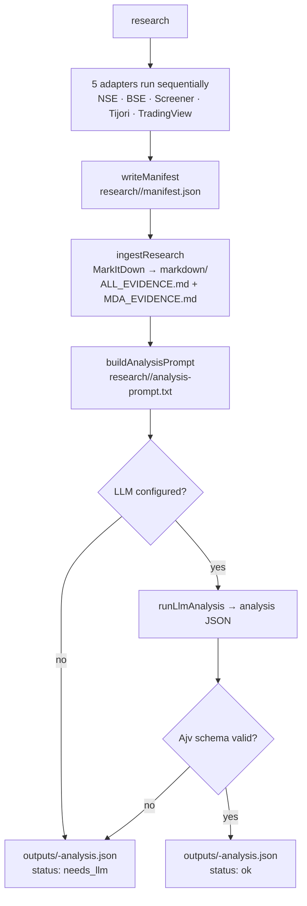

# AGENTS.md

This file provides guidance to Codex (Codex.ai/code) when working in this repository.

## What this is

An Indian-equity research pipeline. It collects six evidence packs for a ticker (NSE/BSE annual reports, MDA, concall transcripts, a TradingView 1D chart, a Screener.in fundamental snapshot, and a shareholding pattern), normalizes raw artifacts to Markdown via Microsoft MarkItDown, then asks an LLM to produce a single validated analysis JSON (`outputs/<ticker>-analysis.json`).

## Commands

Runtime: **Node.js 20+**, TypeScript via `tsx` (no build step — `npm run*` runs `tsx src/index.ts ...`).

```bash
npm install                                  # deps only; nothing else
npm run research -- RELIANCE                 # full pipeline: acquire → ingest → prompt → LLM → validate
npm run ingest -- RELIANCE                   # re-run MarkItDown normalization over an existing research/ folder
npm run validate -- RELIANCE                 # Ajv-validation check on outputs/<ticker>-analysis.json
npm run prompt -- RELIANCE                   # print the assembled analysis-prompt.txt path
```

Single-test style: there are no unit tests; verification is the `validate` command plus inspecting `research/<TICKER>/`. To re-run just one adapter, import it from `src/adapters/<name>.ts` and call `runXxx(ctx)` with an `AdapterContext`.

## Environment setup

```powershell
.\scripts\install-tools.ps1        # or scripts/install-tools.sh on POSIX
Copy-Item .env.example .env
```

`.env` is gitignored and holds secrets. Required only for the LLM stage:

```powershell
LLM_ENDPOINT=https://api.openai.com/v1/chat/completions
LLM_API_KEY=...
LLM_MODEL=...
LLM_TIMEOUT_MS=120000
```

Without these, the pipeline still completes acquisition + normalization and writes a `needs_llm` status object pointing at the prompt. Other knobs: `PLAYWRIGHT_CLI` (defaults to `npx playwright-cli`), `MARKITDOWN_BIN` (defaults to `markitdown`), `NSE_TIMEOUT_MS`, `SOURCE_TIMEOUT_MS`, `CONCALL_LIMIT` (3), `ANNUAL_REPORT_LIMIT` (3), `BSE_SCRIPTS_JSON` (default `./config/bse-scripts.json`, e.g. `RELIANCE: 500325`).

## Architecture

- **`src/index.ts`** — CLI entry. Four subcommands. `research()` runs the five adapters sequentially, merges `artifacts`/`gaps`/`warnings`, writes `manifest.json`, ingests, builds the prompt, runs the LLM (if configured), and Ajv-validates the result. Failures in an adapter are caught and recorded as warnings — one bad source never aborts the run.
- **`src/adapters/{nse,bse,screener,tijori,tradingview}.ts`** — one adapter per source. Each navigates a browser via `playwrightRunCode` (a Playwright `run-code` script), extracts page text/links/tables, takes a full-page screenshot, and returns `SourceArtifact[]`. NSE is the primary source for annual reports and shareholding; BSE is a fallback and needs a scrip code; Screener is primary for fundamentals + concall PDFs; Tijori is secondary concall context; TradingView supplies the 1D chart screenshot and technicals.
- **`src/lib/`** — `cli.ts` (spawn helpers, `extractJson` pulls JSON out of Playwright stdout), `download.ts` (fetch with browser UA), `fs.ts`, `ingest.ts` (MarkItDown walk → `markdown/ALL_EVIDENCE.md` + heuristic `MDA_EVIDENCE.md`), `manifest.ts`, `prompt.ts` (assembles the LLM payload), `llm.ts` (OpenAI-compatible `chat/completions` call).
- **`src/schema.ts`** + **`skills/stock-analysis/JSON_SCHEMA.md`** — the Ajv contract the LLM output must satisfy (22 required top-level fields).
- **`src/types/research.ts`** — `SourceArtifact`, `ResearchManifest`, `AdapterContext`, `AdapterResult`.

### Pipeline stages (one `research` invocation)



The pipeline is a linear chain with one branch point: the LLM call is optional. If it is unset or fails validation, the output is a `needs_llm` status object pointing at `analysis-prompt.txt` — re-run with `LLM_*` env vars to produce the real analysis. `ingest`, `validate`, and `prompt` are separate subcommands that re-use the `research/<TICKER>/` folder already written by `research`.

## Adapter conventions

Each source adapter in `src/adapters/` follows the same structural pattern. If you add a sixth adapter, match it.

1. **URL builder.** Construct the target URL from the ticker (and, for BSE, the scrip code from `config/bse-scripts.json`).
2. **Session.** Derive a Playwright session name from `PLAYWRIGHT_SESSION_PREFIX` + ticker + adapter name (`...-${ticker}-<name>`), so each source gets its own browser session.
3. **Discover script.** Run `playwrightRunCode` with a self-contained `async (page) => {...}` that waits for the page to settle, then returns `JSON.stringify({url, title, text, links, tables?})` — page text is captured with `page.locator('body').innerText().catch(()=> '')` so a dead element never throws.
4. **Snapshot + screenshot.** Write the extracted JSON to `research/<TICKER>/raw/<source>/...` and capture a full-page PNG to `research/<TICKER>/screenshots/` via `runPlaywrightCli(['-s',session,'screenshot','--full-page', ...])`.
5. **Download.** For PDFs discovered in the page links (`uniquePdfLinks` / `unique` filters), download them to `raw/<source>/<subdir>/` with `downloadFile(url, path, {Referer: <page url>})` and emit an `annual_report`/`concall` `SourceArtifact` with `localPath`.
6. **Result.** Push `SourceArtifact[]` with `id`, `type`, `provider`, `title`, `url`, `localPath`, `screenshotPath`, `retrievedAt` (ISO), `period`, and `status` (`ok` | `partial` | `not_found` | `blocked` | `error`). Surface anything unobtainable as a `gap` or `warning` string, never as an exception.
7. **Wrap in try/catch.** A thrown error becomes a `warnings.push(...)` entry and a `gaps.push(...)` — the adapter result is always well-formed. `index.ts` merges these into the manifest's `dataGaps`/`warnings` arrays.

**Evidence types** used across adapters (from `src/types/research.ts`): `annual_report`, `mda`, `concall`, `technical_chart`, `screener_fundamentals`, `shareholding`, `market_data`, `news`.

**Source hierarchy** (enforced in `skills/playwright-research/SOURCE_MAP.md`): NSE > BSE for filings; Screener > Tijori for concalls; TradingView is authoritative for chart structure only, never for inferred indicator values.

## Alternative LLM path: OpenRouter Agent SDK

The current LLM stage (`src/lib/llm.ts`) is a hand-rolled `fetch` to an OpenAI-compatible `chat/completions` endpoint with a single `temperature: 0.15` call and no tool loop. The **OpenRouter Agent SDK** (`@openrouter/agent`) is a drop-in richer alternative: it handles multi-turn tool execution, streaming, stop conditions, and state persistence out of the box, while still calling the same OpenAI-compatible upstream through OpenRouter's model router.

### Install / enable

```bash
/plugin marketplace add OpenRouterTeam/skills
/plugin install openrouter@openrouter
```

The Codex integration gives Codex knowledge of the SDK and requires one env var:

```bash
export OPENROUTER_API_KEY=...
```

Then in code:

```typescript
import { OpenRouter } from '@openrouter/agent';

const openrouter = new OpenRouter({ apiKey: process.env.OPENROUTER_API_KEY });
```

### Mapping onto this repo

The `llm.ts` call is the obvious seam to swap. Instead of:

```typescript
const body = { model, messages: [{role:'system',...},{role:'user',...}], temperature: 0.15 };
const r = await fetch(endpoint, { method:'POST', headers:{...}, body: JSON.stringify(body) });
```

you can call the SDK directly, which gives you the same single JSON answer plus tool-calling and streaming:

```typescript
const result = openrouter.callModel({
  model: 'anthropic/Codex-sonnet-4',
  input: [{ role: 'user', content: prompt.prompt }],   // string, chat array, or OpenResponses input
  tools: [validateSchemaTool],                           // optional — see tools below
  stopWhen: [stepCountIs(3), maxCost(0.10)],             // optional — see stop conditions below
  sessionId: `research:${ticker}`,
});
const clean = await result.getText();                    // or getResponse() for full typed payload
await writeText(analysisOut, clean);
```

The existing Ajv validation in `src/index.ts` still applies on top — the SDK only changes *how* the model is called, not the contract it must satisfy.

### SDK concepts worth knowing

| Concept | What it is | Why it matters here |
| --- | --- | --- |
| `callModel(request)` | The single entry point. Runs an inference loop: sends messages, auto-executes tool calls, feeds results back, repeats until a stop condition. | Replaces the one-shot `fetch` in `llm.ts` with an agent loop. |
| `tool()` | Helper that defines a tool: `name`, `description`, `inputSchema` (Zod), `outputSchema`, `execute`. | You can give the analyst agent real tools — e.g. a `validate_schema` tool that runs Ajv, or a `read_evidence` tool that reads `ALL_EVIDENCE.md`. |
| `model` as a function | `model: (ctx) => ctx.numberOfTurns > 3 ? 'openai/gpt-5.2' : 'openai/gpt-5-nano'` | Escalate to a stronger model only when the first pass fails schema validation, instead of always paying for the big model. |
| `nextTurnParams` | Tools set `instructions`/`temperature`/`model` for the *next* turn based on their own output. | A validation tool that fails can inject "retry with stricter JSON" instructions without a second call site. |
| `stopWhen` | `stepCountIs(n)`, `maxCost(amount)`, `hasToolCall(name)`, `maxTokensUsed(n)`, `finishReasonIs(reason)`. Array = any condition halts. | Bound cost and turns — important since these run unattended over large evidence files. |
| `allowFinalResponse` | When `stopWhen` halts mid-tool-call, the SDK runs pending calls and makes one final text turn. String overrides the appended directive; `false` disables it. | Guarantees you always get a verdict, never a dangling tool call. |
| Streaming | `getTextStream()` (deltas), `getItemsStream()` (recommended — full entries replaced by ID), `getReasoningStream()`, `getFullResponsesStream()`. | Stream partial JSON to the terminal while the run is in progress. |
| Messages | Accepts a plain string, OpenAI chat array, or OpenResponses input. Roles: `system`, `user`, `assistant`, `developer`, `tool`. Images via URL or base64. | You can pass the existing `analysis-prompt.txt` content verbatim as a user message. |
| Items | `getItemsStream()` yields `message`, `function_call`, `reasoning`, `web_search_call`, `file_search_call`, `image_generation_call`, `function_call_output` — each keyed by a stable ID with full (not delta) content. | Replaces manual message-array bookkeeping; tool calls and text stream concurrently. |
| Async tools | `execute` is a `run` handler (`async (input, ctx) => ...`) with `ctx.signal`, `ctx.onMessage`, `ctx.log`, `ctx.defer`. `lifecycle: 'background'` or `'deferred'`. Generator tools `yield` progress, `return` the result. | A long-running evidence-extraction tool (e.g. scraping a PDF) wouldn't block the loop. |
| MCP tools | `createMCPTools({ url, auth: {kind:'bearer', token} })` with `'streamableHttp'` or `'sse'` transport. Returns `mcp.tools` + `mcp.serialize()` + `mcp.close()`. | Wire up an external MCP server — e.g. a financial-data MCP — as first-class agent tools. |
| Lifecycle hooks | `SessionStart`, `UserPromptSubmit`, `PostModelCall`, `PermissionRequest`, `PreToolUse`, `PostToolUse`, `PostToolUseFailure`, `Stop`, `SessionEnd`. Each handler gets `(payload, { signal, hookName, sessionId })`. | These mirror Codex's own hook names. `PreToolUse` can mutate tool input (e.g. cap a `limit`); `PostToolUse` can record latency. |
| Doom-loop detection | Off by default; enable with `doomLoop: true`, tuned via a `ladder` (`observe` → `steer` → `escalate` → `block` → `stop`). Detects repeating tool calls, server-tool requests, or identical text. | These runs eat large evidence files and loop unattended — a runaway loop would otherwise burn budget silently. |
| Tool approval / HITL | `requireApproval: true` (or a `(params, ctx) => boolean` per tool or per call). Pauses with `status: 'awaiting_approval'`, persists via `StateAccessor` (`load`/`save`), resumes with `approveToolCalls`/`rejectToolCalls` arrays. | If you ever run this in an interactive context, dangerous tools (downloads, file writes) pause for a human yes/no. |
| Skills | A `SKILL.md` file (e.g. `~/.Codex/skills/<name>/SKILL.md`) is injected by a `Skill` tool via `nextTurnParams.input`, tagged with a `[Skill: <name>]` marker and idempotently re-loaded. | The repo already has `skills/stock-analysis/SKILL.md` — you could load it as an SDK skill instead of inlining it into the prompt. |
| DevTools | `createOpenRouterDevtools()` passed to the `OpenRouter` constructor hooks. Runs `openrouter devtools` (port 4983, configurable via `~/.openrouter/Codex-proxy.json`). **Never in production** — throws when `NODE_ENV === 'production'`. | Debug a run: model calls, tool calls, token/cost, sessions, steps, multi-run comparison. |

### Practical note

Adopting the SDK is a `llm.ts`-only change if you keep the prompt builder and Ajv step as-is. The two things it buys immediately over the current fetch are **stop conditions** (so a misbehaving model can't loop forever on your evidence) and **streaming** (so you see partial output instead of waiting for the whole 22-field JSON). Add tools and HITL only if you want the analyst agent to act on the filesystem rather than just read the assembled prompt.

## Gotchas

- `extractJson` finds the first `{` or `[` and parses from there — Playwright stdout must be JSON-shaped or it falls back to scanning lines in reverse.
- BSE's legacy annual-report URL is auto-generated (`.../AnnualReport/{scrip}/{scrip}03{yy}.pdf`) and only used as a fallback when no in-page PDF links are found; it needs a valid scrip code from `config/bse-scripts.json`.
- `ingest.ts` walks `research/<TICKER>/raw/` recursively for supported extensions; unsupported files (e.g. `.png`) are ignored.
- The `.Codex/skills/` dir holds a local copy of `playwright-cli` skill metadata — not the project's own skills (those live in `skills/`).
