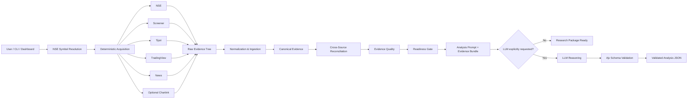
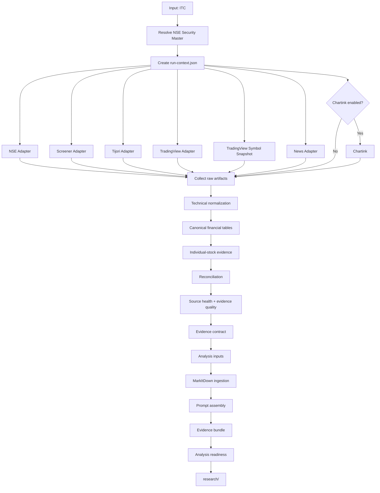
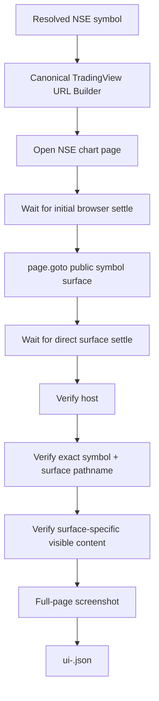
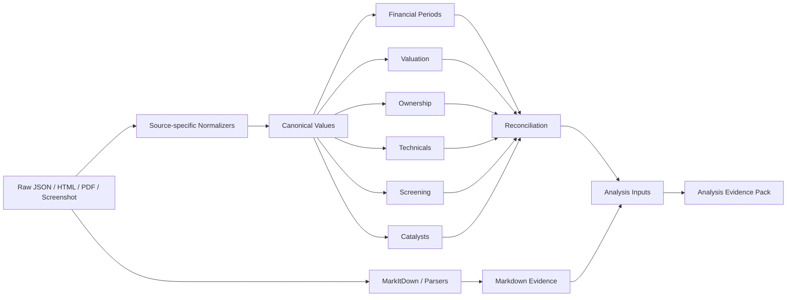
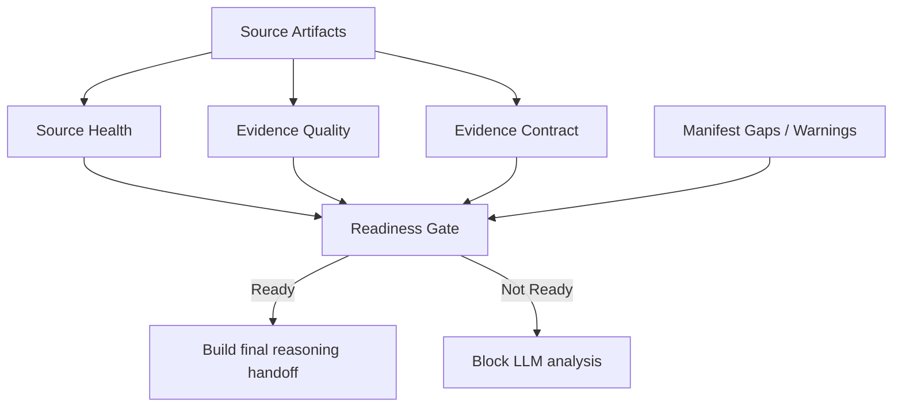
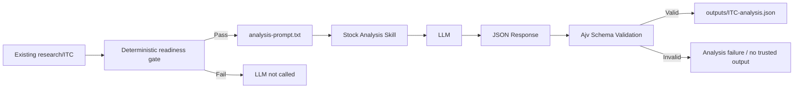
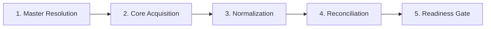
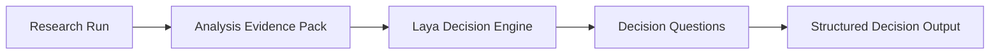
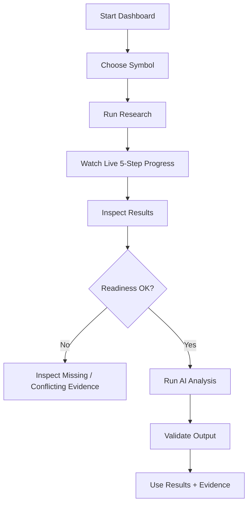

# Stock Research Pipeline v1.50.0

Deterministic, NSE-first Indian equity research pipeline that turns a stock symbol into an auditable evidence package, a readiness decision, and — only when explicitly requested — a schema-validated AI investment analysis.

The project is designed around one principle:

> **Collect and validate evidence deterministically first. Use an LLM only for the final interpretation.**

It combines official NSE data, Screener, Tijori, TradingView, optional news/Chartink evidence, document normalization, cross-source reconciliation, quality gates, a local web control center, market scans, performance tracking, and an optional LLM reasoning stage.

> **Important:** This project produces research evidence and analysis inputs. It is not investment advice.


## Google Sheets export

**StockResearch workbook:** [Open StockResearch — Research & Analysis](https://docs.google.com/spreadsheets/d/1YMKesB9CBnntEnLp-rznzuOOixWDwX6WaWqb-FmtRak/edit?gid=0#gid=0)

### Dashboard Google Sheets sync

The local Control Center now includes a **Google Sheets Sync** navigation tab, a live publish-status strip and a **sixth pipeline step** below the five research stages. It polls the local `/api/sheets/status` endpoint and displays waiting, publishing, success, failure or skipped states along with the latest run, row counts, tabs and screenshot results. Use the tab to retry publishing existing research, analysis, Laya decisions or supported market scans. Credentials are never rendered into the browser.

Automatic publishing requires `GOOGLE_SHEETS_WEBHOOK_URL` and `GOOGLE_SHEETS_WEBHOOK_TOKEN` in the local `.env`. When they are absent, the dashboard deliberately shows **NOT CONFIGURED** rather than implying that data synced.


**UI/sync reference:** [Google AI Studio preview](https://aistudio.google.com/apps/bf7ddb4a-486d-46db-9e2a-4cc6cfcfee5c?showPreview=true&showAssistant=true). The app preview was not inspectable through the connected web fetch in this session; see [the staged rollout plan](docs/GOOGLE_SHEETS_PUBLISHING_PLAN.md) for status and acceptance criteria.


Every supported npm command and every `src/index.ts` CLI command now runs through a shared Google Sheets lifecycle. The dashboard-launched research, batch, scan and analysis processes announce the step when triggered and finalize a run record when they exit. Each completed command/process appends an execution-audit row to `command-runs-YYYY-MM-DD`; data-producing commands also publish their specialized research, analysis or scan tabs. While a process is active the sixth step shows **PROCESS RUNNING**; at completion it shows whether the run record synced, was skipped, failed, or could not sync because credentials are missing. The process exit status and the Sheet sync status are tracked separately in the audit row.

The pipeline can publish classified research and investment-analysis reports into the linked workbook through the optional Apps Script sink under `integrations/google-sheets/`. Research and analysis exports create dedicated summary, findings/evidence, quality/score, risk, catalyst, scenario, source, audit, and visual-evidence tabs. Chart screenshots are embedded in the visual-evidence tab when file-size limits permit.

Example:

```powershell
npm run sheets:export -- research ITC
npm run sheets:export -- analysis ITC
npm run sheets:export -- fullscan ITC --file research/ITC/fullscan.json
npm run sheets:export -- chartinkScan --file scans/chartink-market-scans.json
```

Expected tab naming:

```text
ITC-YYYY-MM-DD-research-summary
ITC-YYYY-MM-DD-research-evidence
ITC-YYYY-MM-DD-research-sources
ITC-YYYY-MM-DD-research-findings
ITC-YYYY-MM-DD-research-quality
ITC-YYYY-MM-DD-research-visual-evidence
ITC-YYYY-MM-DD-analysis-summary
ITC-YYYY-MM-DD-analysis-findings
ITC-YYYY-MM-DD-analysis-scores
ITC-YYYY-MM-DD-analysis-risks
ITC-YYYY-MM-DD-analysis-catalysts
ITC-YYYY-MM-DD-analysis-scenarios
ITC-YYYY-MM-DD-analysis-sources
ITC-YYYY-MM-DD-analysis-audit
ITC-YYYY-MM-DD-analysis-visual-evidence
ITC-YYYY-MM-DD-fullscan
chartinkScan-YYYY-MM-DD
nse52wScan-YYYY-MM-DD
screenerScan-YYYY-MM-DD
tijoriScan-YYYY-MM-DD
command-runs-YYYY-MM-DD
ITC-YYYY-MM-DD-news
ITC-YYYY-MM-DD-laya
```

When `GOOGLE_SHEETS_WEBHOOK_URL` and `GOOGLE_SHEETS_WEBHOOK_TOKEN` are configured, standard `npm run research -- SYMBOL` and `npm run analyze -- SYMBOL` commands publish their results automatically after local output is generated, and other commands append a command-run audit row. Set `GOOGLE_SHEETS_AUTO_EXPORT=false` to disable automatic publishing; manual exports remain available. The `StockResearch` tab is the workbook's clickable index and `_EXPORT_LOG` records published runs. A Sheets outage never invalidates locally saved research or analysis. See [Google Sheets Export](integrations/google-sheets/README.md).

## Developer & Agent Operating System

This repository is designed to be usable by both humans and model-driven coding agents without binding the project to one AI vendor.

Start here:

- [AGENTS.md](AGENTS.md) — canonical coding-agent and developer rules
- [MEMORY.md](MEMORY.md) — stable architecture facts
- [HANDOFF.md](HANDOFF.md) — current state, blockers, and next actions
- [TODO.md](TODO.md) — prioritized backlog
- [DECISIONS.md](DECISIONS.md) — compact architecture decisions
- [CONTRIBUTING.md](CONTRIBUTING.md) — Git workflow and review expectations
- [docs/AGENT_GUIDE.md](docs/AGENT_GUIDE.md) — context-efficient agent workflow
- [docs/PRD.md](docs/PRD.md) — product requirement index

### Context-efficient research handoff

For a researched symbol, agents should prefer:

```text
research/<SYMBOL>/manifest.json
research/<SYMBOL>/analysis-readiness.json
research/<SYMBOL>/normalized/analysis-evidence-pack.json
research/<SYMBOL>/normalized/analysis-inputs.json
research/<SYMBOL>/normalized/reconciliation.json
research/<SYMBOL>/source-health.json
research/<SYMBOL>/evidence-quality.json
```

Use raw PDFs, HTML, and screenshots only when a provenance check or missing detail requires them.

### Repository contract

The project is intentionally agent-neutral. The stable interfaces are the CLI commands, deterministic research artifacts, JSON schemas, and documented source contracts. A future agent tool or model provider should wrap these interfaces rather than redefine them.


---

## What this project actually does

Given a symbol such as:

`ITC`, `RELIANCE`, `HDFCBANK`, `TCS`

the pipeline:

1. Resolves the symbol against the NSE security master.
2. Builds a deterministic research context for the company.
3. Collects evidence from the configured source adapters.
4. Stores the raw source artifacts without replacing them with model-generated text.
5. Captures TradingView charts, technicals, and public symbol-page surfaces with Playwright.
6. Converts supported documents into Markdown using Microsoft MarkItDown.
7. Calculates deterministic technical indicators and canonical financial tables.
8. Reconciles facts across sources and preserves conflicts.
9. Produces source-health, evidence-quality, evidence-contract, and readiness reports.
10. Builds a deterministic analysis handoff package.
11. Optionally invokes an LLM **only after the readiness gate passes**.
12. Validates the final LLM JSON against the project's schema.

The result is not just "an answer". It is a traceable research tree that lets you inspect **what was collected, where it came from, how fresh it is, what conflicts exist, and why analysis was or was not allowed to run**.

---

# Architecture at a glance



### Separation of responsibilities

```text
┌─────────────────────────────────────────────────────────────┐
│                    DETERMINISTIC PHASE                     │
│                                                             │
│  Symbol → Sources → Raw Evidence → Normalize → Reconcile  │
│            → Quality → Readiness → Prompt/Evidence Pack   │
└─────────────────────────────────────────────────────────────┘
                              │
                              │ only when explicitly requested
                              ▼
┌─────────────────────────────────────────────────────────────┐
│                       AI PHASE                             │
│                                                             │
│  Analysis Prompt → LLM Reasoning → JSON Schema Validation │
└─────────────────────────────────────────────────────────────┘
```

The LLM is intentionally outside the acquisition path. It is not used to discover reports, scrape source pages, invent missing values, or interpret screenshot pixels as numeric truth.

---

# Core source model

The default individual-stock source policy is:

| Source | Role | Purpose |
|---|---|---|
| **NSE** | Core | Exchange-level market data, historical data, filings, corporate information |
| **Screener.in** | Core | Fundamentals, financial tables, concalls and company context |
| **Tijori** | Core | Supplementary financial/operational context and industry information |
| **TradingView** | Core | Charts, technical page evidence and visual/audit surfaces |
| **News** | Supplementary | Headline aggregation and deterministic sentiment |
| **Chartink** | Optional | Stock-level screening when the feature flag is enabled |
| **BSE** | Excluded from production model | Not part of the production source hierarchy |

The source hierarchy and reconciliation layer preserve provenance rather than silently replacing conflicting values.

---

# End-to-end research flow

A normal command is:

```powershell
npm run research -- ITC
```

This is an **acquisition + deterministic preparation workflow**. It does not require an LLM.

The execution flow is:



### What happens in each stage

### 1. Symbol resolution

Inputs are normalized and resolved against the NSE security master.

Examples accepted by the research layer:

```text
ITC
NSE:ITC
ITC.NS
https://in.tradingview.com/chart/?symbol=NSE%3AITC
```

The resolved instrument gives the pipeline a canonical NSE security identity before acquisition starts.

---

### 2. Core source acquisition

The adapters run sequentially so every source has an isolated research role and its own diagnostics.

The main acquisition set is:

```text
NSE
  ↓
Screener
  ↓
Tijori
  ↓
TradingView
  ↓
TradingView Symbol Snapshot
  ↓
News
  ↓
Chartink (optional)
```

Each adapter returns structured `SourceArtifact` records containing information such as:

- provider
- artifact type
- URL
- local evidence path
- screenshot path when applicable
- retrieval timestamp
- status
- method
- notes

---

### 3. Raw evidence is preserved

The pipeline does not jump directly from a website to an LLM prompt.

Instead it creates a research tree such as:

```text
research/
└── ITC/
    ├── run-context.json
    ├── manifest.json
    ├── acquisition-report.json
    ├── raw/
    │   ├── nse-api/
    │   ├── screener/
    │   ├── tijori/
    │   ├── tradingview/
    │   ├── news/
    │   └── ...
    ├── normalized/
    ├── markdown/
    ├── screenshots/
    └── debug/
```

This makes the run auditable and reproducible.

---

# TradingView capture architecture

TradingView is deliberately split into structured evidence and visual/audit evidence.

## Public surface capture

The production path uses direct public symbol-page navigation.

For an NSE stock:

```text
https://in.tradingview.com/symbols/NSE-ITC/news/
https://in.tradingview.com/symbols/NSE-ITC/documents/
https://in.tradingview.com/symbols/NSE-ITC/seasonals/
https://in.tradingview.com/symbols/NSE-ITC/community/
https://in.tradingview.com/symbols/NSE-ITC/forecast-price-target/
```

The symbol is dynamic.

Surface URLs are centrally generated in:

```text
src/lib/tradingview-url.ts
```

The adapter does **not** depend on the changing Metrics/More launcher DOM.

### TradingView surface flow



A surface is considered successful only when navigation, route verification, content confirmation, and screenshot capture all succeed.

Screenshots remain visual evidence. Numeric facts should come from structured sources or deterministic calculations.

---

# What the TradingView evidence tree looks like

For ITC, the expected visual output is:

```text
research/ITC/
├── raw/
│   └── tradingview/
│       ├── chart-page.json
│       ├── fullchart-5y.json
│       ├── fullchart-all.json
│       ├── technicals-page.json
│       ├── symbol-scanner-normalized.json
│       ├── ui-surfaces.json
│       ├── ui-forecast.json
│       ├── ui-news.json
│       ├── ui-documents.json
│       ├── ui-seasonals.json
│       └── ui-community.json
│
└── screenshots/
    ├── tradingview-1d.png
    ├── tradingview-fullchart-5y.png
    ├── tradingview-fullchart-all.png
    ├── tradingview-technicals.png
    ├── tradingview-forecast.png
    ├── tradingview-news.png
    ├── tradingview-documents.png
    ├── tradingview-seasonals.png
    └── tradingview-community.png
```

---

# Deterministic normalization and reconciliation

After acquisition, the project converts raw evidence into structured analysis inputs.



Important deterministic artifacts include:

```text
normalized/
├── identity.json
├── market.json
├── financials.json
├── financial-periods.json
├── valuation.json
├── ownership.json
├── technicals.json
├── screening.json
├── catalysts.json
├── canonical-values.json
├── reconciliation.json
├── analysis-inputs.json
└── analysis-evidence-pack.json
```

### Technical indicators

The pipeline can calculate technical metrics deterministically from acquired NSE EQ history.

The intended rule is:

```text
NSE historical data
      ↓
deterministic calculation
      ↓
EMA50 / EMA200 / RSI14
```

These calculated values are not inferred from TradingView screenshot pixels.

---

# Evidence quality and readiness gate

The pipeline has multiple quality layers before the LLM is allowed to run.



The readiness gate checks required deterministic artifacts, core evidence completeness, actionable warnings, manifest gaps, and the evidence contract.

A blocked analysis is a **quality result**, not a failure of the LLM.

For example:

```text
research/
  acquisition ✅
  normalization ✅
  reconciliation ✅
  evidence quality ⚠️
  readiness ❌
  LLM not called
```

That is intentional.

---

# Final AI analysis flow

The AI stage is separate.

Run:

```powershell
npm run analyze -- ITC
```

Internally:



The project therefore has a clean boundary:

```text
Acquisition + Evidence Engineering
        ≠
AI Investment Reasoning
```

---

# Running the project

## 1. Prerequisites

Recommended runtime:

- Node.js 20+
- Python 3.10+ for MarkItDown
- Chromium through Playwright
- Git
- Windows PowerShell or a POSIX shell

Install Node dependencies:

```powershell
npm install
```

Install Chromium:

```powershell
npx playwright install chromium
```

Create environment configuration:

```powershell
Copy-Item .env.example .env
```

For document ingestion, create the Python environment:

```powershell
py -m venv .venv
.\.venv\Scripts\Activate.ps1
python -m pip install "markitdown[all]"
```

---

# Run a stock research job

Example:

```powershell
npm run research -- ITC
```

When this completes, inspect:

```text
research/ITC/
├── manifest.json
├── acquisition-report.json
├── analysis-prompt.txt
├── source-health.json
├── evidence-quality.json
├── evidence-contract.json
├── normalized/
├── markdown/
├── screenshots/
└── debug/
```

To produce the final AI analysis after the readiness gate:

```powershell
npm run analyze -- ITC
```

The final output is:

```text
outputs/ITC-analysis.json
```

To validate an existing analysis:

```powershell
npm run validate -- ITC
```

---

# Run the local dashboard / Control Center

The repository contains a local web dashboard backed by the Node server.

Start it with:

```powershell
npm run dashboard
```

Then open:

```text
http://localhost:3000
```

The dashboard is a **local control center**, not the GitHub Pages site.

The GitHub Pages deployment is only a static project overview. The functional dashboard needs the local Node API because it launches research processes and reads the local research filesystem.

---

# Dashboard overview

The Control Center currently exposes these areas:

```text
┌───────────────────────────────────────────────────────────┐
│              STOCK RESEARCH CONTROL CENTER                │
├───────────────────────────────────────────────────────────┤
│ Overview │ Launch │ Results │ Scans │ Tracking │ History │
│ Laya Decisions │ Settings                                  │
├───────────────────────────────────────────────────────────┤
│                   LIVE PROGRESS STEPPER                   │
│  1 Master → 2 Acquisition → 3 Normalize → 4 Reconcile   │
│                         → 5 Readiness                      │
├───────────────────────────────────────────────────────────┤
│                         WORKSPACE                         │
└───────────────────────────────────────────────────────────┘
```

## Overview

The Overview tab gives you:

- configured watchlist
- NSE symbol/company search
- recent research executions
- source count/status
- readiness information
- direct navigation to results

The watchlist is stored through `config/config.json`.

---

## Launch Runs

The Launch Runs tab lets you start:

### Single stock research

Enter a symbol and trigger:

```text
Run Research Now
```

Optional controls allow supplementary News and Chartink behavior.

The dashboard calls the local API, which launches the same CLI pipeline you would run from PowerShell.

### Batch research

You can run a symbol list such as:

```text
ITC HDFCBANK IOC HPCL RELIANCE TCS INFY
```

The dashboard launches the batch runner sequentially.

---

# Live five-step progress

The dashboard has a live progress banner backed by `/api/runs/progress`.

The five stages are:



### Step 1 — Master Resolution

The ticker is resolved against the NSE equity universe.

### Step 2 — Core Acquisition

The configured core adapters run:

```text
NSE
Screener
Tijori
TradingView
```

Supplementary/optional acquisition may also run.

### Step 3 — Normalization

Raw source material is transformed into structured evidence and Markdown.

### Step 4 — Reconciliation

Canonical facts are assembled and cross-source conflicts are preserved.

### Step 5 — Readiness Gate

The pipeline determines whether the evidence is sufficient for final reasoning.

The dashboard displays this state in real time.

---

# Results Inspector

The Results Inspector lets you select a researched symbol and inspect the evidence already written to disk.

It can expose:

- canonical facts
- valuation
- technicals
- financials
- readiness gate
- source health
- manifest summary

It also provides actions for:

- running the final AI analysis
- opening the symbol in the Laya decision engine

The dashboard does not manufacture values. It reads the deterministic artifacts generated by the research pipeline.

---

# Market Scans

The Market Scans tab provides a simple control surface for long-lived market datasets.

Supported scan families include:

### Chartink Top 20

```powershell
npm run chartink:top20
```

### NSE 52-week highs

```powershell
npm run nse:52week-high
```

### Chartink market scans

```powershell
npm run market:scans
```

### Screener market screens

```powershell
npm run screener-screens
```

### Tijori market dashboards

```powershell
npm run tijori-market
```

The dashboard can trigger the selected scan and then load the stored dataset.

---

# Performance Tracker

The dashboard also contains a Performance Tracker.

It maintains a long-lived record of scanned stocks and can calculate:

- total tracked stocks
- gain ratio
- average return
- best performer
- scanned-stock performance history

The API is backed by the project performance tracker and stores its state under the research data tree.

This is intentionally separate from the stock research evidence model.

```text
Market Scan
    ↓
Candidate Stocks
    ↓
Performance Tracker
    ↓
Observed follow-up performance
```

It does not turn historical performance into a guaranteed future recommendation.

---

# Run History

Every dashboard-triggered run can be recorded in:

```text
research/history/run-history.json
```

The history system tracks:

- run ID
- type
- target
- start time
- end time
- duration
- status
- readiness score
- sources
- error information when applicable

This enables the dashboard to show recent executions and success-rate metrics.

---

# Laya Decisions

The dashboard includes a Laya Decisions surface.

Laya consumes the deterministic analysis evidence pack:

```text
research/<SYMBOL>/
└── normalized/
    └── analysis-evidence-pack.json
```

The Laya engine operates on this evidence package rather than scraping sources itself.

Conceptually:



This gives the project another reasoning layer without changing the underlying source evidence contract.

---

# Dashboard API

The local server exposes API endpoints for the Control Center.

Important endpoints include:

| Endpoint | Purpose |
|---|---|
| `GET /api/config` | Read dashboard configuration |
| `POST /api/config` | Save configuration |
| `POST /api/trigger/research` | Start stock research |
| `POST /api/trigger/batch` | Start batch research |
| `POST /api/trigger/scan` | Start market scan |
| `POST /api/trigger/analyze` | Start LLM analysis |
| `POST /api/trigger/laya` | Run Laya decisions |
| `GET /api/securities/search?q=...` | Search NSE securities |
| `POST /api/watchlist/add` | Add a validated NSE symbol |
| `POST /api/watchlist/remove` | Remove a watchlist symbol |
| `GET /api/tracking` | Read performance tracker |
| `POST /api/tracking` | Record/update tracking |
| `GET /api/history` | Read run history |
| `GET /api/runs/progress` | Read current live progress |
| `GET /api/runs` | List available research runs |
| `GET /api/results/<SYMBOL>` | Read research results |
| `GET /api/scans?type=...` | Read scan output |
| `GET /api/laya/<SYMBOL>` | Read Laya decisions |

The server intentionally prevents overlapping pipeline executions. If a run is already active, a new launch returns a `busy` response rather than starting competing processes.

---

# Dashboard configuration

The main configuration file is:

```text
config/config.json
```

Current defaults include:

```json
{
  "symbols": [
    "ITC",
    "HDFCBANK",
    "IOC",
    "HPCL",
    "RELIANCE",
    "TCS",
    "INFY"
  ],
  "sources": {
    "nse": true,
    "screener": true,
    "tijori": true,
    "tradingview": true,
    "chartink": false,
    "news": true,
    "bse": false
  },
  "pipeline": {
    "defaultExchange": "NSE",
    "concallLimit": 3,
    "annualReportLimit": 3,
    "tradingViewUiSurfaces": [
      "forecast",
      "news",
      "documents",
      "seasonals",
      "community"
    ]
  }
}
```

Use the dashboard Settings Config page or edit `config/config.json` directly.

---

# Environment configuration

Important variables in `.env` include:

## Research

```dotenv
RESEARCH_INCLUDE_CHARTINK=false
DEBUG_CONSOLE=true
```

## Network

```dotenv
NSE_TIMEOUT_MS=30000
SOURCE_TIMEOUT_MS=45000
```

## News

```dotenv
NEWS_ENABLE_GOOGLE_RSS=true
NEWS_TV_MAX_PAGES=3
```

## TradingView

```dotenv
TRADINGVIEW_UI_SURFACES=forecast,news,documents,seasonals,community
TRADINGVIEW_INITIAL_SETTLE_MS=8000
TRADINGVIEW_DIRECT_SURFACE_SETTLE_MS=5000
TRADINGVIEW_DIRECT_SURFACE_TIMEOUT_MS=120000
TRADINGVIEW_UI_CONFIRM_TIMEOUT_MS=10000
TRADINGVIEW_RANGE_SETTLE_MS=3000
```

## LLM

The LLM is optional for acquisition but required for the final `analyze` stage.

```dotenv
LLM_ENDPOINT=https://api.openai.com/v1/chat/completions
LLM_API_KEY=your_key_here
LLM_MODEL=gpt-4o
LLM_TIMEOUT_MS=120000
```

Never commit the private `.env` file.

---

# Research directory explained

A typical stock directory looks like:

```text
research/RELIANCE/
│
├── run-context.json
├── manifest.json
├── acquisition-report.json
├── analysis-prompt.txt
├── analysis-readiness.json
├── source-health.json
├── evidence-quality.json
├── evidence-contract.json
│
├── raw/
│   ├── nse-api/
│   ├── screener/
│   ├── tijori/
│   ├── tradingview/
│   ├── news/
│   └── ...
│
├── normalized/
│   ├── identity.json
│   ├── market.json
│   ├── financials.json
│   ├── financial-periods.json
│   ├── valuation.json
│   ├── ownership.json
│   ├── technicals.json
│   ├── screening.json
│   ├── catalysts.json
│   ├── canonical-values.json
│   ├── reconciliation.json
│   ├── analysis-inputs.json
│   └── analysis-evidence-pack.json
│
├── markdown/
│   ├── ALL_EVIDENCE.md
│   ├── STRUCTURED_EVIDENCE.md
│   ├── MDA_EVIDENCE.md
│   └── INGESTION_REPORT.json
│
├── screenshots/
│   ├── tradingview-1d.png
│   ├── tradingview-fullchart-5y.png
│   ├── tradingview-fullchart-all.png
│   ├── tradingview-technicals.png
│   ├── tradingview-forecast.png
│   ├── tradingview-news.png
│   ├── tradingview-documents.png
│   ├── tradingview-seasonals.png
│   └── tradingview-community.png
│
└── debug/
    ├── acquisition-debug.json
    ├── acquisition-debug.jsonl
    ├── acquisition-timeline.txt
    ├── artifact-index.json
    └── sources/
```

### The most important files

| File | Meaning |
|---|---|
| `manifest.json` | Master run manifest |
| `acquisition-report.json` | Acquisition summary and next-step information |
| `source-health.json` | Provider health and warnings |
| `evidence-quality.json` | Evidence completeness/quality report |
| `evidence-contract.json` | Canonical source-derived facts and calculated metrics |
| `analysis-readiness.json` | Gate deciding whether reasoning is allowed |
| `normalized/analysis-inputs.json` | Compact deterministic reasoning handoff |
| `normalized/analysis-evidence-pack.json` | Full deterministic evidence package |
| `analysis-prompt.txt` | Final prompt context prepared for the LLM |
| `screenshots/` | Visual evidence |
| `debug/` | Acquisition diagnostics |

---

# Useful commands

## Individual research

```powershell
npm run research -- ITC
```

## Final AI analysis

```powershell
npm run analyze -- ITC
```

## Validate final analysis

```powershell
npm run validate -- ITC
```

## Standalone TradingView research

```powershell
npm run research:tradingview -- ITC
```

## TradingView UI surfaces

```powershell
npm run tradingview:ui -- ITC
```

## TradingView diagnostic run

```powershell
npm run tradingview-doctor -- ITC
```

## News research

```powershell
npm run research:news -- ITC
```

## Market scans

```powershell
npm run market:scans
npm run chartink:top20
npm run nse:52week-high
npm run screener-screens
npm run tijori-market
```

## Batch research

```powershell
npm run research:batch -- ITC HDFCBANK IOC HPCL RELIANCE TCS INFY
```

## Dashboard

```powershell
npm run dashboard
```

Then open:

```text
http://localhost:3000
```

## Full test suite

```powershell
npm run test:all
```

## Version check

```powershell
npm run version:check
```

## Debug acquisition

```powershell
npm run debug:show -- ITC
```

---

# Testing strategy

The unified test runner executes deterministic regression suites covering areas such as:

```text
Symbol normalization
       ↓
Source classification
       ↓
Source precedence
       ↓
Canonical evidence
       ↓
Analysis readiness
       ↓
Evidence completeness
       ↓
News sentiment
       ↓
TradingView URL routing
       ↓
TradingView surface confirmation
       ↓
TradingView direct-page behavior
```

TradingView has dedicated regression coverage for:

- canonical URL generation
- dynamic symbol routing
- direct public-page capture
- removal of the obsolete Metrics launcher path
- exact route confirmation
- evidence-pack wiring

Live browser diagnostics are separate from static regression tests.

---

# Troubleshooting

## Dashboard does not open

Check:

```powershell
npm run dashboard
```

Then browse to:

```text
http://localhost:3000
```

If port 3000 is occupied, change:

```json
"server": {
  "port": 3000,
  "host": "127.0.0.1",
  "cors": true
}
```

in `config/config.json`.

---

## Research says a symbol is invalid

Run:

```powershell
npm run nse:lookup -- ITC
```

or:

```powershell
npm run nse:validate-symbol -- ITC
```

The production research path expects a valid NSE security resolved from the configured security master.

---

## TradingView capture is partial

Run:

```powershell
npm run tradingview-doctor -- ITC
```

Then inspect:

```text
research/ITC/raw/tradingview/
research/ITC/screenshots/
research/ITC/debug/
```

Check the surface JSON files for:

```text
targetUrl
navigation
final.url
routeHint
contentHint
surfaceConfirmed
screenshot
```

A partial screenshot is retained as supplementary evidence instead of being silently treated as a fully confirmed source.

---

## Readiness gate blocks AI analysis

Inspect:

```text
research/ITC/analysis-readiness.json
research/ITC/evidence-quality.json
research/ITC/evidence-contract.json
research/ITC/source-health.json
```

The goal is to fix missing or contradictory evidence rather than bypass the gate.

---

## MarkItDown problems

Run:

```powershell
npm run markitdown:doctor
```

Verify:

```powershell
markitdown --version
```

and confirm the Python virtual environment is active.

---

# Project structure

```text
stockResearchApp/
│
├── config/
│   └── config.json
│
├── data/
│   └── NSE security master data
│
├── docs/
│   ├── ONBOARDING.md
│   ├── ARCHITECTURE.md
│   ├── CLI_REFERENCE.md
│   ├── PIPELINE_OPERATING_GUIDE.md
│   ├── TESTING_AND_QUALITY.md
│   └── ...
│
├── public/
│   └── index.html          # local interactive dashboard
│
├── site/
│   └── index.html          # static GitHub Pages overview
│
├── scripts/
│   ├── test-*.ts
│   ├── run-batch-research.ts
│   └── maintenance / diagnostic scripts
│
├── src/
│   ├── adapters/
│   ├── lib/
│   ├── types/
│   ├── schema.ts
│   ├── index.ts
│   └── server.ts
│
├── skills/
│   └── stock-analysis/
│
├── package.json
├── package-lock.json
└── .env.example
```

---

# Development model

The project follows these engineering boundaries:

```text
Source adapters
    ↓
raw evidence
    ↓
normalization
    ↓
canonical values
    ↓
reconciliation
    ↓
quality/readiness
    ↓
LLM boundary
```

### Rules worth preserving

1. **Do not invent source-derived values.**
2. **Do not replace raw evidence with only an LLM summary.**
3. **Preserve conflicts between sources.**
4. **Keep screenshots as visual evidence, not numeric truth.**
5. **Keep acquisition deterministic.**
6. **Keep the LLM boundary explicit.**
7. **Do not bypass the readiness gate just to obtain a verdict.**
8. **Keep TradingView surface routing centralized in `src/lib/tradingview-url.ts`.**
9. **Keep the analysis evidence contract stable for downstream consumers.**

---

# GitHub Pages vs local Dashboard

There are two different web experiences in the repository.

## GitHub Pages

```text
site/index.html
```

This is a static project overview intended for documentation/discovery.

It does not run the research pipeline.

## Local Dashboard

```text
public/index.html
      +
src/server.ts
      +
research/ filesystem
      +
CLI process launcher
```

This is the functional Control Center.

It can:

- search NSE securities
- manage the watchlist
- start research
- start batch runs
- start scans
- launch AI analysis
- inspect results
- inspect readiness
- inspect run history
- inspect performance tracking
- run Laya decisions
- edit configuration

---

# Typical daily workflow

For normal usage, the intended workflow is:



For a more automated workflow:

```text
Batch / Cron
    ↓
Research runs
    ↓
Evidence packages
    ↓
Readiness
    ↓
Selected analyses
    ↓
Run History + Performance Tracking
```

---

# Recommended first run

After cloning the repository:

```powershell
npm install
npx playwright install chromium

Copy-Item .env.example .env

npm run version:check
npm run research -- ITC
```

Then inspect:

```text
research/ITC/analysis-readiness.json
research/ITC/normalized/analysis-evidence-pack.json
research/ITC/raw/tradingview/
research/ITC/screenshots/
```

Start the dashboard:

```powershell
npm run dashboard
```

Open:

```text
http://localhost:3000
```

After reviewing the deterministic evidence:

```powershell
npm run analyze -- ITC
npm run validate -- ITC
```

---

# Documentation map

For deeper implementation details, start here:

| Topic | Document |
|---|---|
| First-time setup | `docs/ONBOARDING.md` |
| Architecture | `docs/ARCHITECTURE.md` |
| CLI and environment variables | `docs/CLI_REFERENCE.md` |
| Operational workflows | `docs/PIPELINE_OPERATING_GUIDE.md` |
| TradingView capture | `docs/TRADINGVIEW_UI_SURFACES.md` |
| TradingView debugging | `docs/TRADINGVIEW_UI_SURFACE_DEBUG.md` |
| Testing and quality | `docs/TESTING_AND_QUALITY.md` |
| Evidence contract | `docs/EVIDENCE_CONTRACT.md` |
| Release history | `docs/RELEASES_AND_CHANGELOG.md` |

---

## Release

Current release: **v1.50.0**

The v1.50 release makes TradingView public surface capture a direct-navigation-only production path, centralizes TradingView URL construction, strengthens route/content confirmation, removes the legacy Metrics/More launcher implementation, and preserves the existing downstream evidence-pack contract.
