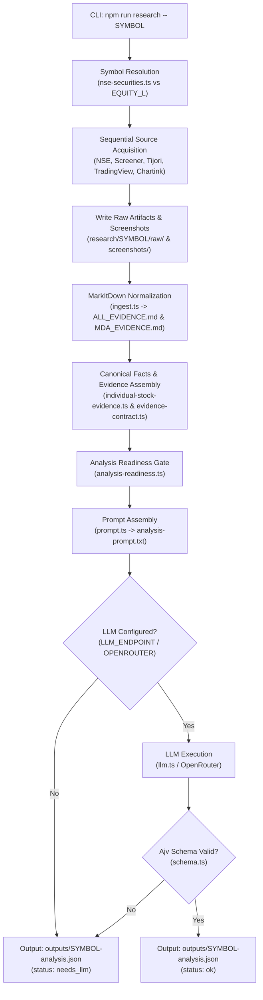

# Stock Research Pipeline Architecture Guide

This document details the system architecture, design principles, data acquisition flow, normalization pipeline, and validation contracts of the **Stock Research Pipeline** (v1.49.5).

---

## 🌟 Core Architectural Design Principles

1. **Deterministic Data Acquisition First**:
   - The acquisition and normalization phases operate **without LLM dependencies**.
   - Raw HTTP queries use `webfetch` (`node-fetch` + cookie jar), while browser automation uses `playwright-cli` (isolated chromium sessions).
   - Document normalization (PDF, HTML, DOCX, XLSX, PPTX) uses Microsoft MarkItDown into clean Markdown.

2. **Symbol-Agnostic NSE Master Resolution**:
   - Every input symbol (e.g. `ITC`, `NSE:ITC`, `ITC.NS`, TradingView URL) is normalized and resolved against the official NSE `EQUITY_L` security master (`data/nse-equity-universe.json`).
   - Ensures individual stock research strictly operates on valid, active `EQ` series securities.

3. **Strict Separation of Core vs Optional Sources**:
   - **Core Default Set**: `NSE` + `Screener` + `Tijori` + `TradingView`.
   - **Opt-in Sources**: `Chartink` (controlled via `RESEARCH_INCLUDE_CHARTINK=true`).
   - **Excluded Sources**: `BSE` (excluded from production research).

4. **Multi-Stage Evidence Pipeline & Readiness Gate**:
   - Raw artifacts are transformed into structured canonical facts (`CANONICAL_FACTS.json`), technical metrics (`TECHNICAL_NORMALIZED.json`), and individual stock evidence packs (`INDIVIDUAL_STOCK_EVIDENCE.json`).
   - An explicit **Analysis Readiness Gate** (`analysis-readiness.json`) checks coverage, freshness, and evidence completeness before allowing LLM inference.

5. **Schema-Validated AI Reasoning**:
   - LLM analysis (OpenAI-compatible endpoint or OpenRouter Agent SDK) is restricted to the final `analyze` stage.
   - Outputs are strictly validated using Ajv against a 22-field JSON schema contract (`src/schema.ts`).

---

## 🔄 End-to-End Pipeline Data Flow



---

## 📂 Research Directory Structure per Symbol

Each execution of `npm run research -- <SYMBOL>` produces a deterministic folder structure under `research/<SYMBOL>/`:

```text
research/<SYMBOL>/
├── run-context.json                 # Execution parameters, timestamps, resolved security master
├── acquisition-report.json          # Per-source fetch status, latency, and artifacts map
├── manifest.json                    # Overall research manifest with dataGaps and warnings
├── analysis-prompt.txt              # Assembled markdown context for LLM prompt
├── raw/                             # Unmodified response files
│   ├── nse-quote.json
│   ├── nse-nextapi/
│   ├── screener/
│   ├── tijori/
│   ├── tradingview/
│   └── annual-reports/
├── derived/                         # Deterministic normalized evidence
│   ├── CANONICAL_FACTS.json
│   ├── TECHNICAL_NORMALIZED.json
│   ├── INDIVIDUAL_STOCK_EVIDENCE.json
│   ├── EVIDENCE_CONTRACT.json
│   └── analysis-readiness.json
├── markdown/                        # MarkItDown output
│   ├── ALL_EVIDENCE.md
│   ├── STRUCTURED_EVIDENCE.md
│   └── MDA_EVIDENCE.md
├── screenshots/                     # Page capture PNGs
│   ├── nse-overview.png
│   ├── screener-fundamentals.png
│   ├── tijori-overview.png
│   └── tradingview-1d-chart.png
└── debug/                           # Source diagnostic traces
    ├── acquisition-debug.json
    └── acquisition-timeline.txt
```

---

## 🏛️ System Architecture Components

### 1. Source Adapters (`src/adapters/`)
Each adapter implements source-specific acquisition logic using a common structural pattern:
- **`nse.ts`**: Fetches stock quote, historical OHLCV chunks, corporate announcements, shareholding pattern, and annual report links via direct NextAPI and Playwright fallback.
- **`screener.ts`**: Extracts fundamental ratios, 10-year P&L, balance sheet, cash flows, and concall transcript links.
- **`tijori.ts`**: Captures product revenue breakups, sector metrics, and operational performance.
- **`tradingview.ts`**: Launches Playwright to capture full 1D chart screenshots and technical summary indicators directly from public symbol pages.
- **`chartink.ts`**: Opt-in scanner adapter for custom technical filters and screen outputs.
- **`news-sentiment.ts`**: Aggregates recent Google News and financial media headlines, evaluating sentiment impact.

### 2. Evidence Reconciliation & Canonical Engine (`src/lib/`)
- **`individual-stock-evidence.ts`**: Standardizes metrics across disparate sources using strict precedence rules.
- **`canonical-extract.ts` & `canonical-financials.ts`**: Extracts revenue, EBITDA, PAT, debt, ROE, and margin trends into strongly typed canonical numbers.
- **`evidence-contract.ts`**: Checks mandatory evidence presence (e.g. at least 3 concalls, 3 annual reports, 1D chart, shareholding pattern).
- **`analysis-readiness.ts`**: Evaluates overall research score (0 to 100%) and returns a boolean readiness flag (`isReadyForAnalysis`).

### 3. Schema & LLM Integration (`src/schema.ts` & `src/lib/llm.ts`)
- **JSON Schema (`src/schema.ts`)**: Defines 22 required fields including `valuationScore`, `growthScore`, `moatScore`, `riskScore`, `investmentVerdict`, `targetPriceRange`, `keyRisks`, and `catalysts`.
- **LLM Driver (`src/lib/llm.ts`)**: Invokes OpenAI-compatible chat endpoints or OpenRouter Agent SDK with deterministic low temperature (`0.15`) and structured output enforcement.

---

## 🛡️ Error Handling & Isolation Guarantees

1. **Adapter Non-Blocking Principle**:
   - Adapter execution is wrapped in `try/catch` blocks.
   - If one source (e.g. Tijori or TradingView) fails or times out, the error is recorded as a warning in `manifest.json`.
   - The pipeline continues gathering evidence from remaining sources.

2. **Browser Session Isolation**:
   - Playwright CLI sessions are prefixed per symbol and source (e.g. `stock-research-RELIANCE-screener`).
   - Prevents cookie collision, state corruption, or browser hang propagation across adapters.

---

## 📜 Run History & Progress Stepper Subsystem

### 1. Run History Storage (`research/history/run-history.json`)
- Maintained by `src/lib/run-history.ts`.
- Logs execution run entries with `runId`, `type` (`individual_research` | `market_scan`), `target`, `startTime`, `endTime`, `durationSeconds`, `status`, `readinessScore`, and `sourcesAcquired`.

### 2. Live Progress Stepper State Machine (`/api/runs/progress`)
The execution flow updates a 5-step progress stepper:
1. `Step 1/5: Symbol Master Resolution` — Resolves symbol against official NSE `EQUITY_L` universe.
2. `Step 2/5: Core Source Acquisition` — Sequential execution across `NSE`, `Screener`, `Tijori`, `TradingView`.
3. `Step 3/5: MarkItDown Normalization` — Normalizes PDFs/HTML/XLSX into clean Markdown.
4. `Step 4/5: Canonical Reconciliation` — Reconciles metrics into `CANONICAL_FACTS.json`.
5. `Step 5/5: Analysis Readiness Gate` — Evaluates readiness score and completes execution.

